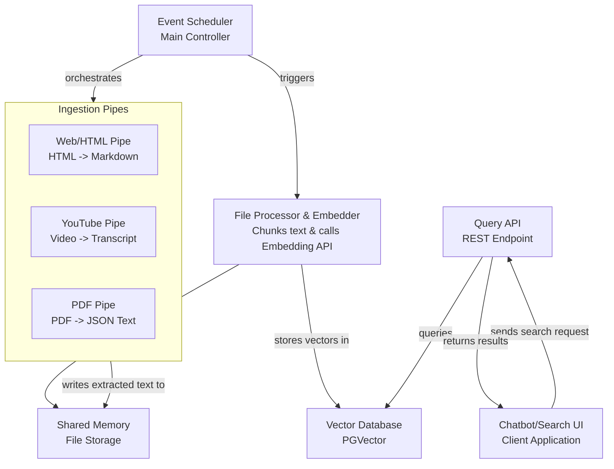
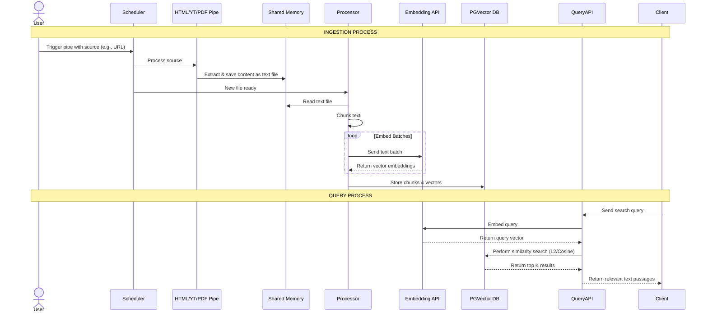

# **PolyglotRAG - A Multi-Source Personal Knowledge Retrieval Engine**

PolyglotRAG is a high-performance, locally-run Retrieval-Augmented Generation (RAG) engine designed to unify and make searchable a wide array of personal knowledge sources. It ingests information from disparate formats (websites, videos, PDFs), processes them into a standardized format, and creates a semantically searchable vector database. The system is built in Rust for efficiency, scalability, and extensibility to serve as the core infrastructure for future AI-powered applications.

## **Architectural Overview**

The system follows a modular, pipeline-based architecture centered around an event scheduler, allowing for easy integration of new data sources ("pipes") and processing logic.

**High-Level System Architecture:**

This diagram shows the main components and how data flows between them.



**Detailed Data Flow Sequence:**

This sequence diagram details the step-by-step process for ingesting and querying data.



## **Key Components & Technologies**

* **Language:** Rust (for performance and memory safety)
* **Data Sources:** HTML (via `html2md`), YouTube Transcripts, PDFs (text extraction), raw text blobs (`POST /process/text`)
* **Concurrency:** Multi-threading, System Channels, and Shared Memory for inter-process communication.
* **Database:** PostgreSQL with PGVector extension for efficient vector similarity search.
* **Embeddings:** External API calls to state-of-the-art open source embedding models.
* **API:** RESTful API (built with Axum/Actix-web) to handle search queries.

## **Retrieval response shape**

Retrieval endpoints (`POST /search`, `POST /embeddings/similarity`,
`GET /files/{file_id}/chunks`) all return matches grouped by their owning
document, sharing a single `DocumentWithChunksDto` envelope:

```json
{
  "documents": [
    {
      "id": "…",
      "file_name": "…",
      "file_path": "…",
      "file_type": "…",
      "processing_status": "…",
      "chunks": [
        { "chunk_id": "…", "chunk_text": "…", "chunk_index": 0,
          "page_number": 1, "section_path": null,
          "similarity_score": 0.87 }
      ],
      "assets": [
        { "id": "…", "asset_type": "image", "content_type": "image/png",
          "page_number": 1, "label": "page1-image1.png", "byte_size": 20480,
          "download_url": "/files/<file_id>/assets/<asset_id>/content" }
      ]
    }
  ]
}
```

`similarity_score` is present on search endpoints and omitted on chunk-listing
endpoints. Single-file results stay a single object (not a one-element list).
`assets` carries any binary assets extracted from the document (see
[Multi-format ingest](#multi-format-ingest)); it is `[]` when there are none.

## **Multi-format ingest**

Uploaded documents are dispatched to a format-specific extractor by content
type. Each extractor produces the document's text (chunked + embedded for
search) and, where applicable, **assets** — binary parts such as embedded
images that are stored alongside the file and surfaced in retrieval responses.

| Format | Content type | Text | Per-page | Image assets |
| --- | --- | --- | --- | --- |
| Plain text | `text/plain` | ✅ | — | — |
| HTML | `text/html` | ✅ | — | — |
| PDF | `application/pdf` | ✅ | ✅ | ✅ (JPEG/JPEG2000 verbatim; FlateDecode RGB/Gray re-encoded as PNG; other colorspaces skipped) |
| Word | `application/vnd.openxmlformats-officedocument.wordprocessingml.document` (`.docx`) | ✅ | — | ✅ (`word/media/*`) |
| PowerPoint | `application/vnd.openxmlformats-officedocument.presentationml.presentation` (`.pptx`) | ✅ (per slide) | ✅ | ✅ (`ppt/media/*`) |
| YouTube | `text/youtube-url` | ✅ (transcript) | — | — |

### The asset concept

An **asset** is a binary part extracted from a document. During processing the
bytes are written to the configured [storage backend](#storage-backends) (keyed
by the asset's own id) and a metadata row is recorded. Assets appear in the
`assets` array of the retrieval response (see
[Retrieval response shape](#retrieval-response-shape)) and are fetched via:

```
GET /files/{file_id}/assets/{asset_id}/content
```

Like file content, this streams the bytes for the local backend or issues a
`302` redirect to a short-lived presigned URL for object stores. Assets are
deleted with their owning file (rows cascade; stored bytes are removed
best-effort).

### Fixtures & smoke

Committed fixtures live under `tests/fixtures/` (regenerate deterministically
with `python3 dev/smoke/make_fixtures.py`); `sample.docx`/`sample.pptx` embed a
1×1 PNG so the asset path is exercised. The smoke scripts in `dev/smoke/` and
the gated integration tests (`cargo test --test integration_assets`, run with
`BASE_URL` + `API_KEY`) drive upload → process → search → asset download against
a live stack.

## **Storage backends**

The server is backend-agnostic. `STORAGE_BACKEND` picks the impl; all three
share the `FileStorage` trait, the same key shape (`{tenant_id}/{file_id}`),
and the same endpoints.

| Backend     | Upload flow                                          | Download (`GET /files/{id}/content`)  | Use when |
|-------------|------------------------------------------------------|---------------------------------------|----------|
| `local`     | `POST /upload` (multipart, server reads bytes)       | Server streams bytes back             | Dev / single-node |
| `s3`        | `POST /upload-url` → client `PUT`s to presigned URL  | `302` to presigned `GET`              | AWS S3, R2, MinIO, Wasabi |
| `cloudinary`| `POST /upload-url` → client `POST`s to signed form   | `302` to CDN delivery URL             | Managed CDN, fast edge delivery |

The server **never proxies bytes** for S3 / Cloudinary — clients upload
direct to the bucket/CDN, and the server only mints short-lived signed
URLs. For `local` the server streams bytes through itself.

### Presigned upload flow (S3 / Cloudinary)

```
1. POST /upload-url        { file_name, content_type }
                           → { file_id, method, url, headers, form_fields, expires_at }

2. Client uploads direct:  PUT {url}     (S3)
                           POST {url}    (Cloudinary, with form_fields)

3. POST /files/{id}/complete-upload
                           → enqueues processing job
```

If step 3 never happens, the **storage janitor** sweeps the row + storage
after `JANITOR_DANGLING_THRESHOLD_SECS` (default 30 min).

### Migration from local-only setup

If you were using the server-side multipart upload, no client changes are
needed — `POST /upload` and `POST /upload-and-process` still work and route
to the local backend regardless of `STORAGE_BACKEND`. To take advantage of
presigned uploads, switch the client to the three-step flow above.

The `File.file_path` field is now a **backend key** (`{tenant_id}/{file_id}`)
instead of an absolute host path. Existing rows continue to work for `local`
(the key is relative to `UPLOAD_DIR`); for object stores you'll need a
re-ingest.

### Storage janitor

Background sweep: dangling `Pending` rows get storage + DB deleted, stale
`Processing` rows get re-enqueued. Dangling threshold defaults to
`2 × PRESIGNED_UPLOAD_TTL_SECS` (floor 1800s) so the sweep window tracks
the configured presigned TTL.

### Dev stacks

```bash
# Local backend (filesystem, server streams bytes):
docker compose -f dev/local.docker-compose.yml up

# S3 backend via localstack (no AWS account needed):
docker compose -f dev/localstack.docker-compose.yml up
```

The localstack stack auto-creates the `polyrag-local` bucket on boot.

## **Purpose & Value**

This project solves the "fragmented knowledge" problem. Instead of having information siloed in browser bookmarks, YouTube history, and folders of PDFs, PolyglotRAG creates a unified, semantic search index across all of it. This allows for powerful queries like "find me concepts related to neural attention mechanisms from all my saved articles, videos, and textbooks."
